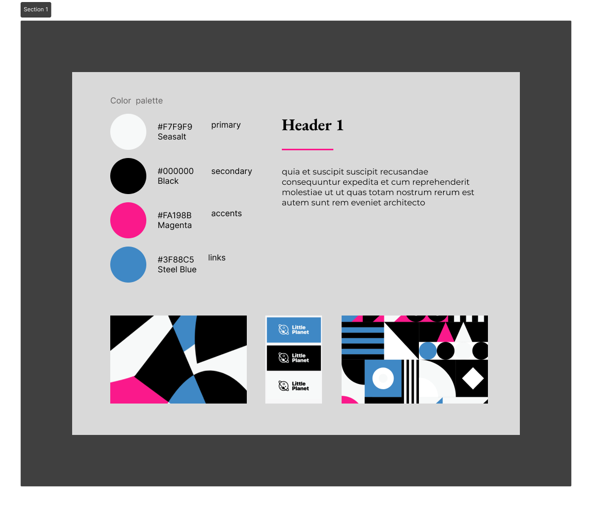

# React Products App

This React application showcases a versatile product listing with advanced filtering and pagination features. The project comprises several key functionalities, including viewing posts, editing posts, deleting posts, and examining the details of a single post. It also employs protected routes to ensure that specific pages are accessible only to authenticated users.

## Features

- **Home Page:** Provides a welcoming introduction.

- **Login Page:** Allows users to log in. Use the following credentials:
  - Email: admin
  - Password: 12345
  User data is stored in local storage.

- **Products Page:** Lists all available products. This page offers an intuitive interface equipped with filtering options, enabling visitors to search for products based on various criteria, such as tags, price, subscription availability, and keyword search. Additionally, a pagination feature simplifies navigation through extensive product listings.

- **Protected Routes:** Certain pages, such as the Posts Page and Single Post Page, are protected routes. Users must log in to access these pages. If a user is not authenticated, they will be redirected to the Login Page.

- **Style guide:** I created a style guide that I used for this project.



## Test Cases for the `Products` Component:

1. **Filtering by Tag**:
   - **Condition of Acceptance**: When a user selects a specific tag (e.g., "Chocolate") from the filter dropdown and applies the filter, only products with that tag should be displayed.
   - **Test Steps**:
     1. Access the Products component.
     2. Choose "Chocolate" from the Tags filter dropdown.
     3. Click the filter/apply button.
   - **Expected Outcome**: The product list should display only products with the "Chocolate" tag.

2. **Clearing Filters**:
   - **Condition of Acceptance**: When a user clicks the "Clear Filters" button, all applied filters (tag, price, subscription, search) should reset, and all products should be displayed.
   - **Test Steps**:
     1. Open the Products component.
     2. Apply one or more filters (e.g., select a tag, enter a price, enable subscription, enter a search query).
     3. Click the "Clear Filters" button.
   - **Expected Outcome**: All applied filters should reset, and the product list should display all products from the data source.

3. **Pagination**:
   - **Condition of Acceptance**: When the number of products exceeds what can be displayed on a single page, clicking on page numbers or next/previous buttons should update the displayed products accordingly.
   - **Test Steps**:
     1. Open the Products component with a large number of products or configure it to display a limited number of products per page (e.g., 2 items per page).
     2. Observe the pagination controls (page numbers, next/previous buttons).
     3. Click on different page numbers and/or next/previous buttons.
   - **Expected Outcome**: The product list should update to display the products on the selected page, and the active page should be highlighted in the pagination controls.

**Additional Test Cases**:
- Test with an empty list of products to ensure the component handles empty data gracefully.
- Test with a large number of products to ensure pagination works correctly.
- Test with different combinations of filters (e.g., tag + price, subscription + search) to ensure the component handles multiple filters properly.

### Installing and Running the Program

1. Clone the repository:
    ```
    git clone the-link-from-repo
    ```
    - You can obtain the link by clicking the `Clone` button in your repository.

2. Open the project folder in your integrated development environment (IDE).

3. Launch a terminal in the project folder.

4. Run `npm install` (or `npm i`) to install the dependencies.

5. Execute `npm start`.

6. Run `npm run test` to execute tests.

7. Open your web browser and visit `http://localhost:3000` to explore the app.

## Technologies Used

- React
- React Router
- SCSS (for styling)
- Jest

## Author

Alina Yermolenko